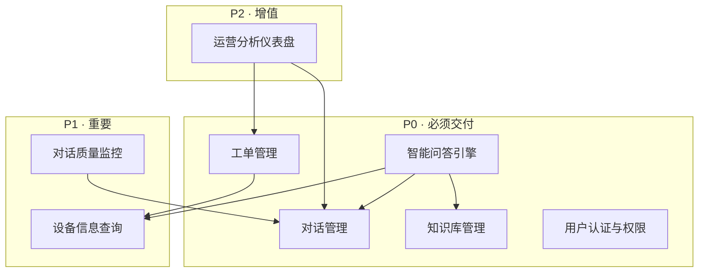

# 04-核心业务模块(1)

# 04 - 核心业务模块

> 这份文档把系统拆成 8 个模块，每个模块说清楚"做什么、为什么是核心、涉及什么技术、对应哪些业务场景"。后面的数据库设计、API 设计、页面设计都以这份文档为基准。

## 1. 模块总览

## 2. P0 · 必须交付

### 2.1 智能问答引擎

| 维度 | 说明 |
| --- | --- |
| **职责** | 接收用户问题 → 意图分类 → 混合检索（Milvus 向量语义 + MySQL 关键词精确） → 检索结果融合排序 → 大模型生成回答（带引用来源） → 置信度评估 → 解决或多轮诊断引导 |
| **为什么是核心** | 系统的核心价值载体，消化大部分重复性售后咨询 |
| **涉及技术** | LangChain RAG 链路、LangGraph 多轮状态机、Milvus 向量检索、MySQL 全文检索、百炼 Qwen-Max、RRF 融合排序 |
| **支撑场景** | 系统集成商故障排查、终端客户使用咨询、SDK/技术集成查询 |

### 2.2 对话管理

| 维度 | 说明 |
| --- | --- |
| **职责** | 多轮对话上下文维护、会话状态持久化（LangGraph checkpoint）、对话历史记录查询、会话超时自动关闭 |
| **为什么是核心** | 故障诊断需要 5~10 轮交互，没有上下文管理就无法做到连贯的排查引导 |
| **涉及技术** | LangGraph checkpoint（Redis 持久化）、MySQL 对话记录表、Redis 会话缓存（TTL 过期） |
| **支撑场景** | 所有需要多轮交互的故障诊断场景 |

### 2.3 知识库管理

| 维度 | 说明 |
| --- | --- |
| **职责** | 文档上传（PDF/Word/Markdown）→ 文本提取 → 智能分块 → 向量化入库 → 文档版本管理 → 过期标记与降权 → 关联产品型号 → 高频引用统计 |
| **为什么是核心** | RAG 的检索质量完全取决于知识库质量。没有高质量知识库，智能问答引擎就是空壳 |
| **涉及技术** | Celery 异步任务、PyMuPDF/python-docx 文档解析、Milvus collection 管理、text-embedding-v3 向量化、MySQL 文档元数据表 |
| **支撑场景** | 知识库管理员日常维护、文档更新迭代 |

### 2.4 工单管理

| 维度 | 说明 |
| --- | --- |
| **职责** | 从对话中自动提取工单信息（设备型号、序列号、故障现象、联系方式） → 信息完整度校验与缺失追问 → 关联保修信息 → 创建工单 → 派发到售后网点 → 状态跟踪 → 完结归档 |
| **为什么是核心** | AI 无法解决的问题必须流转到人工，工单是售后闭环的关键环节 |
| **涉及技术** | LangGraph 工单流程、MySQL 工单表、百炼 Qwen-Plus（对话摘要生成）、售后网点路由规则 |
| **支撑场景** | 经销商报修建单、AI 解决失败后的转人工工单 |

### 2.5 用户认证与权限

| 维度 | 说明 |
| --- | --- |
| **职责** | 用户注册/登录、JWT Token 生成与验证、角色权限控制（6 类角色）、API 级别权限校验 |
| **为什么是核心** | 六类角色权限差异大——终端客户只看自己的对话，管理员要看全局数据，没有权限控制系统无法上线 |
| **涉及技术** | python-jose JWT、FastAPI 依赖注入鉴权、MySQL 用户表与角色表 |
| **支撑场景** | 所有场景的基础设施 |

## 3. P1 · 重要

### 3.1 设备信息查询

| 维度 | 说明 |
| --- | --- |
| **职责** | 按型号查询产品规格参数、接线图、固件版本列表；按序列号查询保修状态、购买渠道；关联产品型号与知识库文档 |
| **为什么重要** | 高频问题涉及"这个型号支持什么功能""保修还有多久"，Agent 需要调用此模块获取结构化数据才能精准回答 |
| **涉及技术** | MySQL 设备信息表、FastAPI 查询接口 |
| **支撑场景** | 系统集成商故障排查（查设备参数）、经销商保修查询 |

### 3.2 对话质量监控

| 维度 | 说明 |
| --- | --- |
| **职责** | 对话记录列表与检索、AI 回答质量标记（准确/不准确/不完整）、用户反馈统计、Prompt 优化建议、知识库缺口识别 |
| **为什么重要** | AI 回答不可能 100% 准确，必须有机制发现问题并持续优化，否则系统越用越差 |
| **涉及技术** | MySQL 对话评价记录表、管理端页面 |
| **支撑场景** | 客服主管日常监控与优化 |

## 4. P2 · 增值

### 4.1 运营分析仪表盘

| 维度 | 说明 |
| --- | --- |
| **职责** | 高频问题 TOP N 排行、知识库覆盖率分析（哪些问题有文档覆盖、哪些没有）、各型号故障率统计、AI 解决率/转人工率趋势、用户满意度走势 |
| **增值点** | 数据驱动优化——告诉运营团队哪些问题该补文档、哪些型号质量有问题需要反馈给产品部门 |
| **涉及技术** | MySQL 聚合查询、前端 ECharts 图表 |
| **支撑场景** | 客服主管定期复盘、管理层决策参考 |

## 5. 业务场景 × 模块映射

| 业务场景 | 覆盖模块 | 校验结果 |
| --- | --- | --- |
| 系统集成商故障排查 | 智能问答引擎 + 对话管理 + 知识库管理 + 设备信息查询 | 每个模块至少支撑 1 个场景 |
| 经销商报修建单 | 工单管理 + 设备信息查询 + 用户认证与权限 | 每个场景至少被 1 个模块覆盖 |
| 终端客户使用咨询 | 智能问答引擎 + 对话管理 + 知识库管理 | 无孤模块 |
| 知识库文档更新 | 知识库管理 + 对话质量监控 | 双向覆盖完整 |
| 对话质量优化 | 对话质量监控 + 运营分析仪表盘 | 运营闭环完整 |
| 系统访问控制 | 用户认证与权限 | 基础设施覆盖所有场景 |