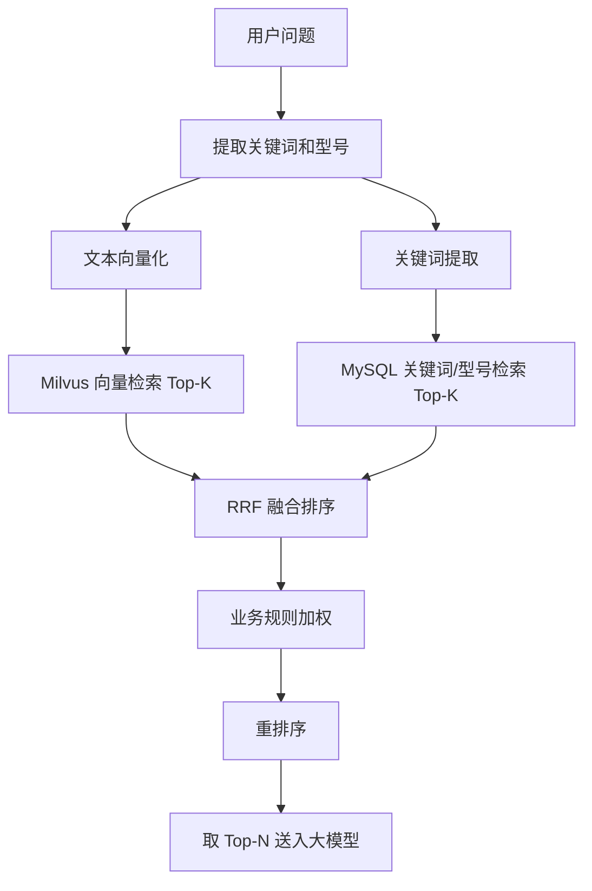

# 05a-混合检索融合排序

# 05a - 混合检索融合排序策略

> Milvus 做语义检索，MySQL 做精确匹配，两路结果怎么合并、怎么排序、权重怎么调——这个策略直接决定了用户问"DS-2CD3T86 画面模糊"时，系统能不能既命中这个型号的产品文档，又找到"画面模糊"相关的排查方案。

## 1. 导读

单一检索方式在海康售后场景下有明显短板：纯向量检索可能漏掉型号精确匹配的文档，纯关键词检索无法理解"画面糊"和"图像不清晰"是同一个意思。混合检索将两路优势互补，但融合排序策略设计不当会导致结果质量不稳定。

## 2. 为什么难

*   **评分体系不同**：Milvus 返回余弦相似度（0~1），MySQL 返回 LIKE 匹配数或全文检索 TF-IDF 分数，量纲不统一
    
*   **型号精确命中需要特殊权重**：用户提到"DS-2CD3T86"，包含该型号的文档应该被强提升，但不能无脑置顶（如果该文档内容和用户问题无关）
    
*   **结果数量不一致**：有时向量检索返回 10 条，关键词检索只返回 2 条，融合时需要处理不对称情况
    
*   **性能要求**：两路检索并行执行，融合排序不能成为瓶颈
    

## 3. 技术方案

采用 **RRF（Reciprocal Rank Fusion）** 作为基础融合算法，叠加业务规则加权：

```plaintext
RRF_score(d) = Σ 1 / (k + rank_i(d))
```

其中 k 为常数（通常取 60），rank\_i(d) 为文档 d 在第 i 路检索中的排名。

在此基础上增加业务加权：

*   型号精确命中：该文档的 RRF 分数 × 1.5
    
*   产品系列命中（如用户问 7 系列，文档属于 7 系列）：RRF 分数 × 1.2
    
*   文档状态为"已过期"：RRF 分数 × 0.3（降权但不完全排除）
    

## 4. 实现思路



## 5. 关键代码示例

```python
from collections import defaultdict

def hybrid_search(query: str, query_embedding: list[float],
                  milvus_collection, mysql_session,
                  model_pattern: str | None = None,
                  k: int = 60, top_n: int = 5) -> list[dict]:
    vector_results = milvus_collection.search(
        data=[query_embedding], limit=10, output_fields=["doc_id", "content", "model_number"]
    )
    keyword_results = mysql_session.execute(
        text("SELECT doc_id, content, model_number FROM kb_chunks "
             "WHERE content LIKE :q OR model_number = :m LIMIT 10"),
        {"q": f"%{query}%", "m": model_pattern or ""}
    ).fetchall()

    rrf_scores = defaultdict(float)
    doc_map = {}
    for rank, hit in enumerate(vector_results[0]):
        doc_id = hit.entity.get("doc_id")
        rrf_scores[doc_id] += 1.0 / (k + rank + 1)
        doc_map[doc_id] = {"content": hit.entity.get("content"), "model_number": hit.entity.get("model_number")}
    for rank, row in enumerate(keyword_results):
        doc_id = row.doc_id
        rrf_scores[doc_id] += 1.0 / (k + rank + 1)
        if doc_id not in doc_map:
            doc_map[doc_id] = {"content": row.content, "model_number": row.model_number}

    for doc_id, score in rrf_scores.items():
        mn = doc_map[doc_id].get("model_number", "")
        if model_pattern and mn == model_pattern:
            rrf_scores[doc_id] = score * 1.5
        elif model_pattern and model_pattern[:3] in mn:
            rrf_scores[doc_id] = score * 1.2

    sorted_docs = sorted(rrf_scores.items(), key=lambda x: x[1], reverse=True)
    return [{"doc_id": d, "score": s, **doc_map[d]} for d, s in sorted_docs[:top_n]]
```

## 6. 涉及业务模块

*   **智能问答引擎**：混合检索是智能问答引擎的核心检索层