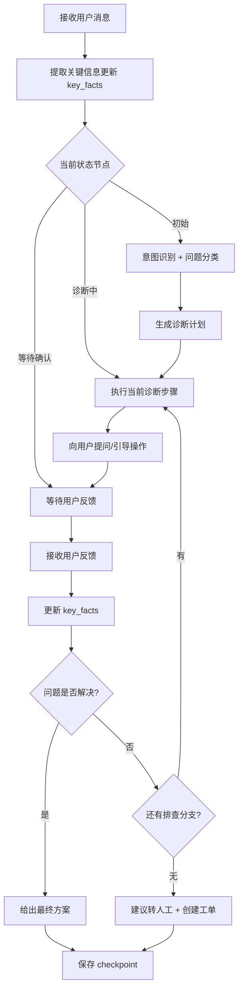

# 05b-多轮对话状态管理

# 05b - 多轮对话状态管理与上下文压缩

> 故障诊断不是一句话能搞定的——"摄像机离线"可能是网络问题、供电问题、配置问题或硬件故障。用户和 AI 之间需要 5~10 轮交互逐步排查，每一轮都要记住前面查过什么、排除了什么。

## 1. 导读

LangGraph 提供了原生的状态机和 checkpoint 机制，但要把它用好有几个坑：上下文窗口有限（10 轮之后早期信息可能被截断）、状态机分支复杂（故障诊断是一棵树而非线性流程）、checkpoint 持久化需要可靠的存储。

## 2. 为什么难

*   **上下文窗口限制**：大模型有 token 上限，10 轮对话（每轮包含检索结果）可能超过 8K token，早期排查信息会被截断
    
*   **状态分支多**：一个"摄像机离线"问题可能有 4~5 条排查分支（网络/供电/配置/硬件），每条分支有不同的后续步骤
    
*   **用户可能跳步或回溯**：用户中途换话题、补充信息或推翻之前的回答，状态机需要能处理非线性对话流
    
*   **checkpoint 恢复**：用户中途关闭页面再回来，需要能从上次断点继续
    

## 3. 技术方案

### 3.1 关键信息锚定

在 LangGraph State 中维护一个 `key_facts` 字典，每轮对话提取关键事实并锚定：

```python
key_facts = {
    "device_model": "DS-2CD3T86",
    "device_count": 6,
    "symptom": "全部离线，NVR显示网络不可达",
    "network_topology": "POE交换机",
    "checked": ["交换机端口灯-正常", "ping摄像机-超时"],
    "ruled_out": ["单台故障", "NVR故障"]
}
```

每次调用大模型时，将 `key_facts` 作为 system prompt 的一部分注入，确保关键信息不会被截断。

### 3.2 状态机设计

使用 LangGraph 的 `StateGraph` 定义诊断流程，每个节点代表一个排查步骤，边代表条件分支。

### 3.3 Redis Checkpoint 持久化

使用 Redis 存储 LangGraph checkpoint，TTL 设为 24 小时（用户可能隔天继续排查）。

## 4. 实现思路



## 5. 关键代码示例

```python
from langgraph.graph import StateGraph, END
from typing import TypedDict, Annotated
import operator

class DiagnosisState(TypedDict):
    messages: Annotated[list, operator.add]
    key_facts: dict
    current_step: str
    diagnosis_plan: list[str]
    step_index: int
    resolved: bool

def build_diagnosis_graph():
    graph = StateGraph(DiagnosisState)
    graph.add_node("intent_classify", intent_classify_node)
    graph.add_node("generate_plan", generate_plan_node)
    graph.add_node("ask_step", ask_step_node)
    graph.add_node("process_feedback", process_feedback_node)
    graph.add_node("resolve", resolve_node)
    graph.add_node("escalate", escalate_node)

    graph.set_entry_point("intent_classify")
    graph.add_edge("intent_classify", "generate_plan")
    graph.add_edge("generate_plan", "ask_step")
    graph.add_conditional_edges("process_feedback", route_after_feedback, {
        "continue": "ask_step",
        "resolve": "resolve",
        "escalate": "escalate"
    })
    graph.add_edge("ask_step", "process_feedback")
    graph.add_edge("resolve", END)
    graph.add_edge("escalate", END)
    return graph.compile()
```

## 6. 涉及业务模块

*   **对话管理**：状态机和 checkpoint 持久化的核心实现
    
*   **智能问答引擎**：诊断流程驱动问答交互