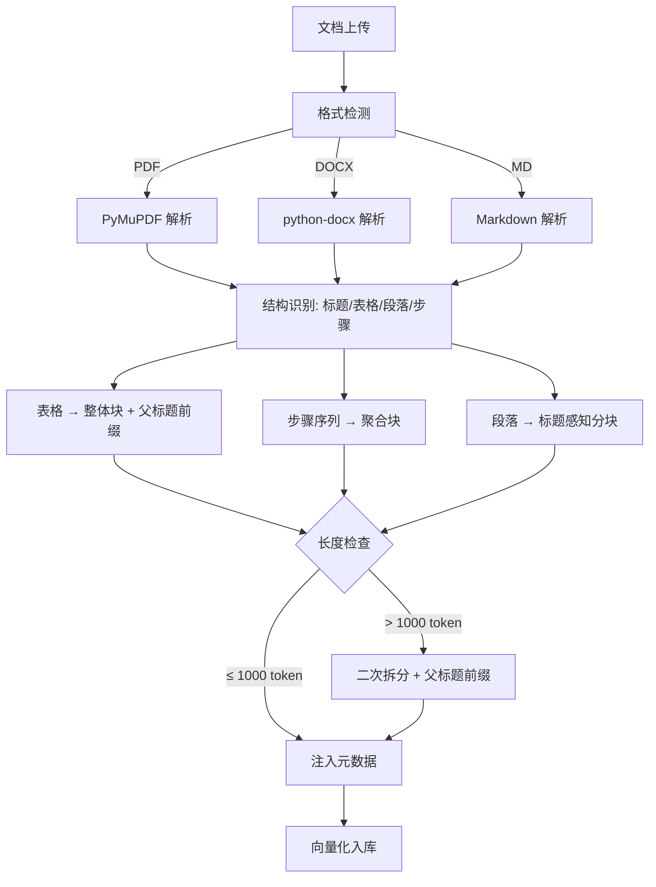

# 05c-技术文档解析与分块

# 05c - 技术文档解析与分块策略

> 海康的产品手册不是普通文章——里面有规格参数表、接线图、配置步骤、错误代码对照表。如果用"按段落切一刀"的方式分块，表格会被拆散，步骤之间的依赖关系会丢失，检索出来的内容就是碎片。

## 1. 导读

知识库质量决定了 RAG 的检索质量，而知识库质量的起点是文档解析和分块。技术文档的结构化程度高，需要专门的分块策略来保持语义完整性。

## 2. 为什么难

*   **PDF 解析质量参差不齐**：海康产品手册的 PDF 排版复杂（多栏、表格跨页、图片嵌入文字），通用 PDF 解析工具容易丢失结构
    
*   **表格不能拆**：规格参数表是一个整体，拆开后单个行没有上下文（"工作温度：-30°C~60°C"脱离了型号信息就没有意义）
    
*   **步骤有依赖**：配置指南通常是有序步骤（第1步 → 第2步 → 第3步），拆开检索后用户可能只看到第3步而不知道前两步
    
*   **分块粒度平衡**：块太小丢失上下文，块太大引入噪声影响检索精度
    

## 3. 技术方案

### 3.1 多格式解析器

| 格式 | 解析工具 | 特殊处理 |
| --- | --- | --- |
| PDF | PyMuPDF | 表格检测（按坐标识别表格区域，整表作为一个块）、图片区域跳过（接线图暂不做 OCR） |
| Word (.docx) | python-docx | 按段落 + 表格结构解析，保持标题层级关系 |
| Markdown | 原生解析 | 按标题层级分块，表格作为整体 |

### 3.2 结构感知分块策略

1.  **标题感知**：以 H2/H3 标题为天然分界点，每个章节作为一个候选块
    
2.  **表格保护**：表格整体作为一个独立块，附加所属章节标题作为上下文前缀
    
3.  **步骤聚合**：有序列表/步骤序列作为一个完整块，不拆分
    
4.  **长度兜底**：超过 1000 token 的块按段落二次拆分，拆分时在子块头部附加父标题
    

### 3.3 元数据注入

每个 chunk 附加以下元数据，辅助检索过滤：

```python
chunk_metadata = {
    "doc_id": "doc_2024_7series_config",
    "product_series": "7系列",
    "product_model": "DS-2CD7A87",
    "chunk_type": "table|step|paragraph",
    "parent_title": "智能侦测配置 > 区域入侵设置",
    "doc_version": "v3.2",
    "status": "active"
}
```

## 4. 实现思路



## 5. 关键代码示例

```python
import fitz

def parse_pdf_tables_and_text(file_path: str) -> list[dict]:
    doc = fitz.open(file_path)

    chunks = [ ]

    current_title = ""

    for page in doc:
        blocks = page.get_text("dict")["blocks"]
        for block in blocks:
            if block["type"] == 0:
                text = " ".join(
                    span["text"] for line in block["lines"] for span in line["spans"]
                )
                if is_heading(text, block):
                    current_title = text.strip()
                    continue
                if len(text.strip()) < 10:
                    continue
                chunks.append({
                    "content": text.strip(),
                    "chunk_type": "paragraph",
                    "parent_title": current_title,
                    "page": page.number
                })
            elif block["type"] == 1:
                table_text = extract_table_text(block)
                if table_text:
                    chunks.append({
                        "content": f"[{current_title}]\n{table_text}",
                        "chunk_type": "table",
                        "parent_title": current_title,
                        "page": page.number
                    })
    return merge_and_split_chunks(chunks, max_tokens=1000)
```

## 6. 涉及业务模块

*   **知识库管理**：文档上传后的解析和分块是知识库入库的前置步骤