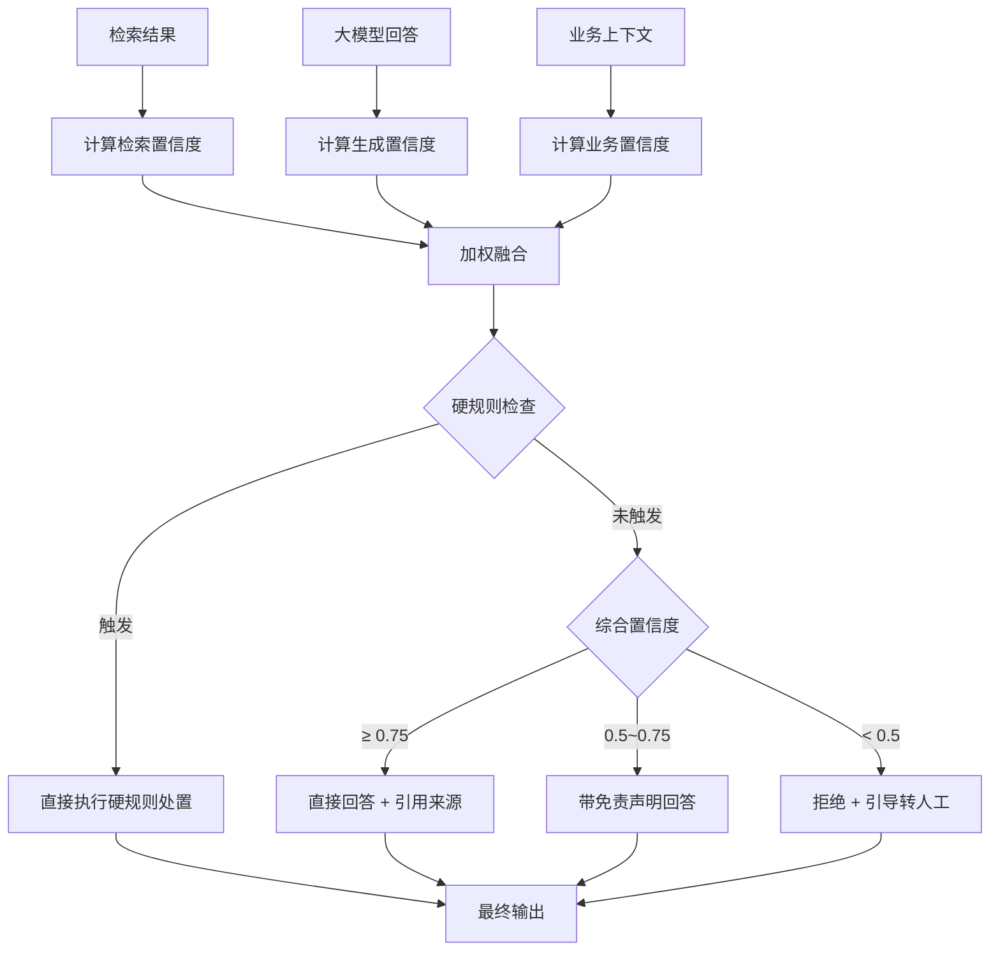

# 05d-AI回答幻觉控制

# 05d - AI 回答幻觉控制与置信度评估

> 大模型可能"一本正经地胡说八道"——告诉用户"请将固件升级到 v5.7.12"，但这个版本号是编造的。在售后技术支持场景，错误指导可能导致设备损坏。宁可说"我不确定"，也不能编。

## 1. 导读

幻觉控制不是单一环节能解决的，需要从检索、生成、验证三个阶段层层把关。置信度评估是这三层的综合输出，决定系统最终是"直接回答""带免责声明回答"还是"拒绝回答并转人工"。

## 2. 为什么难

*   **幻觉难以自动检测**：大模型生成的文本看起来流畅合理，但关键实体（版本号、参数值、操作步骤）可能是编造的
    
*   **检索结果不等于事实**：即使检索到了相关文档，文档本身可能过期或不适用于用户的具体型号
    
*   **置信度阈值需要动态调整**：涉及安全操作（强电、防爆设备）的问题，即使置信度高也需要附加警告
    

## 3. 技术方案

### 3.1 三层信号融合模型

**第一层：检索置信度（权重 0.4）**

| 信号 | 判定规则 | 得分 |
| --- | --- | --- |
| 向量检索相关度 | Milvus top-K 中余弦相似度 ≥ 0.75 的文档数量 | ≥ 3 篇: 1.0 / 1-2 篇: 0.5 / 0 篇: 0 |
| 精确检索命中 | MySQL 按型号/错误码精确匹配是否命中 | 命中: 1.0 / 未命中: 0 |
| 检索结果一致性 | 两路检索是否召回相同文档 | 有重叠: 1.0 / 无重叠: 0.3 |

**第二层：生成置信度（权重 0.4）**

| 信号 | 判定规则 | 得分 |
| --- | --- | --- |
| 引用溯源率 | 回答中关键事实是否能在检索文档中找到对应出处 | ≥ 80%: 1.0 / 50-80%: 0.5 / < 50%: 0 |
| 实体幻觉检测 | 回答中出现的型号/固件版本号/错误代码是否存在于知识库或设备信息表 | 全部存在: 1.0 / 每个未收录实体扣 0.3 |
| 模型自评 | Prompt 中要求模型输出置信度（高/中/低）+ 理由 | 高且合理: 1.0 / 低: 0（直接降级） |

**第三层：业务置信度（权重 0.2）**

| 信号 | 判定规则 | 得分 |
| --- | --- | --- |
| 问题风险等级 | 涉及硬件操作的问题标记为高风险 | 高风险问题置信度阈值自动提高 |
| 设备状态匹配 | 用户提供的型号是否在设备信息表中可查 | 查不到: 降权（可能是停产/非常规设备） |
| 历史解决率 | 同类问题的历史 AI 解决率 | \> 70%: 加分 / < 30%: 降权 |

### 3.2 综合判定与处置策略

```plaintext
综合置信度 = 检索层 × 0.4 + 生成层 × 0.4 + 业务层 × 0.2
```

| 综合置信度 | 处置策略 |
| --- | --- |
| ≥ 0.75 | 直接回答，附带引用来源链接 |
| 0.5 ~ 0.75 | 给出参考答案，标注"以上建议仅供参考，建议联系技术支持确认" |
| < 0.5 | 拒绝猜测，告知"当前信息不足以给出准确建议"，引导转人工或创建工单 |

### 3.3 硬规则（不受评分影响，直接触发）

*   回答中出现的固件版本号不存在于知识库 → 从回答中剔除该版本号，替换为"请参考官网下载页获取最新固件"
    
*   问题涉及安全操作（强电、高空、防爆设备） → 无论置信度多高，附加安全提示
    
*   连续两轮用户反馈"没用/不对" → 自动降级为转人工
    

## 4. 实现思路



## 5. 关键代码示例

```python
def compute_confidence(retrieval_results: list, answer: str,
                       business_context: dict, knowledge_base) -> dict:
    top_k = retrieval_results
    high_sim = sum(1 for r in top_k if r["score"] >= 0.75)
    ret_score = min(1.0, high_sim / 3.0) * 0.5
    ret_score += (1.0 if business_context.get("model_hit") else 0) * 0.3
    ret_score += (1.0 if has_overlap(retrieval_results) else 0.3) * 0.2

    entities = extract_entities(answer)
    known = sum(1 for e in entities if knowledge_base.entity_exists(e))
    trace_rate = known / max(len(entities), 1)
    gen_score = trace_rate * 0.7
    gen_score += (1.0 - min(0.3 * (len(entities) - known), 1.0)) * 0.3

    biz_score = 0.5
    if business_context.get("is_high_risk"):
        biz_score -= 0.2
    if not business_context.get("device_exists"):
        biz_score -= 0.2
    hist_rate = business_context.get("historical_resolve_rate", 0.5)
    biz_score += (hist_rate - 0.5) * 0.4

    total = ret_score * 0.4 + gen_score * 0.4 + biz_score * 0.2

    for e in entities:
        if e["type"] == "firmware_version" and not knowledge_base.entity_exists(e):
            answer = answer.replace(e["value"], "[请参考官网获取最新固件]")

    return {"confidence": total, "answer": answer, "disposition": classify_disposition(total, business_context)}
```

## 6. 涉及业务模块

*   **智能问答引擎**：置信度评估贯穿回答生成的全流程