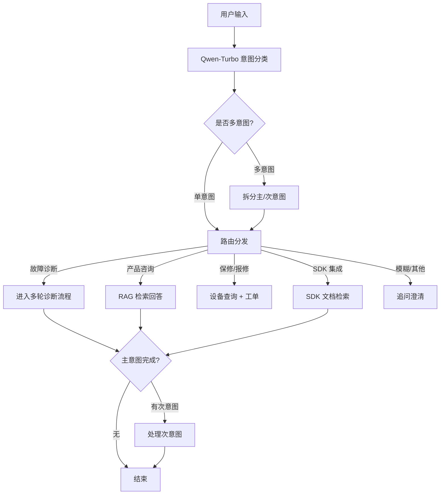

# 05e-意图识别与路由

# 05e - 意图识别与多路由分发

> 用户一句话可能包含多个意图，也可能意图模糊。分错路由会导致答非所问——用户问"保修还有多久"，你却给他一段故障排查指南。

## 1. 导读

意图识别是智能问答引擎的"第一道关卡"，它的准确性和速度直接影响用户体验。本项目采用轻量模型（Qwen-Turbo）做快速分类，支持四类主要意图和兜底策略。

## 2. 为什么难

*   **多意图混合**：一句话可能同时包含故障问题和保修查询（"我的 DS-7608N-K2 开不了机，顺便查一下保修"）
    
*   **意图模糊**：用户描述不清晰（"这东西怎么不好使了"可能是任何类型的问题）
    
*   **领域特殊性**：售后场景的意图分类与通用客服不同，需要识别"型号查询""固件下载""接线图""SDK 调用"等细分意图
    
*   **延迟要求**：意图分类是流程的第一步，延迟不能超过 500ms
    

## 3. 技术方案

### 3.1 意图分类体系

| 一级意图 | 二级意图 | 路由目标 |
| --- | --- | --- |
| 故障诊断 | 设备离线、画面异常、配置故障、硬件故障 | 多轮诊断流程（LangGraph） |
| 产品咨询 | 选型建议、参数查询、功能说明 | RAG 检索 + 直接回答 |
| 保修/报修 | 保修查询、报修申请、进度查询 | 设备信息查询 + 工单管理 |
| SDK/技术集成 | API 调用、SDK 集成、协议对接 | RAG 检索（SDK 文档库） |
| 其他/模糊 | 无法分类或闲聊 | 追问澄清或转人工 |

### 3.2 分类 Prompt 设计

使用 Qwen-Turbo + few-shot 示例，要求模型输出结构化 JSON：

```json
{
  "primary_intent": "故障诊断",
  "secondary_intent": "设备离线",
  "model_number": "DS-2CD3T86",
  "has_secondary_request": true,
  "secondary_intent_type": "保修查询",
  "confidence": 0.92
}
```

### 3.3 多意图处理策略

*   主意图优先处理，处理完后自动触发次意图
    
*   次意图为保修查询时，在回答主问题后主动附上保修状态信息
    

## 4. 实现思路



## 5. 关键代码示例

```python
INTENT_PROMPT = """你是海康威视售后技术支持的意图分类器。
根据用户输入，输出 JSON 格式的意图分类结果。

意图类别：
- fault_diagnosis: 设备故障排查
- product_inquiry: 产品参数/功能/选型咨询
- warranty_service: 保修查询或报修申请
- sdk_integration: SDK/API/协议技术问题
- unclear: 无法判断

示例：
用户："DS-2CD3T86 画面模糊怎么办"
输出：{"primary_intent": "fault_diagnosis", "model_number": "DS-2CD3T86", "has_secondary_request": false}

用户："我的 NVR 开不了机，顺便查查保修"
输出：{"primary_intent": "fault_diagnosis", "has_secondary_request": true, "secondary_intent": "warranty_service"}

用户输入：{user_input}
输出："""

async def classify_intent(user_input: str) -> dict:
    response = await dashscope.acall(
        model="qwen-turbo",
        messages=[{"role": "user", "content": INTENT_PROMPT.format(user_input=user_input)}],
        result_format="json"
    )
    return parse_intent_response(response)
```

## 6. 涉及业务模块

*   **智能问答引擎**：意图分类是所有后续流程的入口