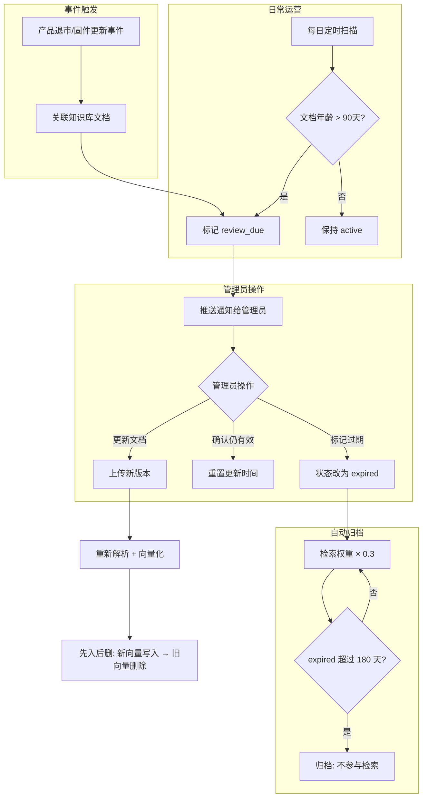

# 05f-知识库增量更新

# 05f - 知识库增量更新与过期内容治理

> 海康产品迭代快，固件版本频繁更新，新型号持续上市。如果知识库只管"入库"不管"出库"，过期文档被检索到就会给出错误指导——告诉用户去下载一个已经不存在的固件版本。

## 1. 导读

知识库不是静态的，而是一个需要持续运营的资产。本文档定义文档的生命周期管理策略，包括版本控制、过期检测、降权策略和高频引用预警。

## 2. 为什么难

*   **过期难以自动检测**：文档没有标准的"有效期"字段，过期判断需要结合产品退市信息、固件版本更新等外部信号
    
*   **降权而非删除**：过期文档可能仍有参考价值（如停产设备的存量用户），不能直接删除，但检索权重必须降低
    
*   **增量更新不能影响在线服务**：文档重新向量化时不能导致检索服务中断
    
*   **关联更新**：一份产品手册更新后，引用该手册的其他文档也需要同步检查
    

## 3. 技术方案

### 3.1 文档生命周期状态

```plaintext
active（生效中）→ review_due（待审核）→ expired（已过期/降权）→ archived（已归档）
```

| 状态 | 触发条件 | 检索行为 |
| --- | --- | --- |
| active | 新上传或审核通过 | 正常权重参与检索 |
| review\_due | 超过 90 天未更新 或 关联产品有新版固件 | 正常权重但标记提醒管理员 |
| expired | 管理员手动标记 或 关联产品已退市 | 权重 × 0.3，回答中附加"该文档可能已过期"提示 |
| archived | 超过 180 天处于 expired 状态 | 不参与检索，但管理后台可查看 |

### 3.2 过期检测触发机制

*   **定时扫描**：每日扫描文档表，超过 90 天未更新的文档标记为 `review_due`
    
*   **产品退市事件**：设备信息表中产品状态变为"退市"时，自动关联该型号下的所有知识库文档进入 `review_due`
    
*   **固件更新事件**：设备信息表中固件版本更新时，关联文档中引用旧版本的内容标记提醒
    

### 3.3 增量更新策略

文档更新时采用"先入后删"策略：

1.  新文档解析、分块、向量化完成后写入 Milvus
    
2.  验证新向量可正常检索
    
3.  删除旧文档的向量记录
    
4.  更新 MySQL 中的文档元数据
    

避免在旧向量删除后、新向量未写入前的空窗期内检索不到相关内容。

## 4. 实现思路



## 5. 关键代码示例

```python
from datetime import datetime, timedelta
from sqlalchemy import select, update

async def scan_expired_documents(session):
    threshold = datetime.now() - timedelta(days=90)
    result = await session.execute(
        select(Document).where(
            Document.status == "active",
            Document.updated_at < threshold
        )
    )
    docs = result.scalars().all()
    for doc in docs:
        doc.status = "review_due"
    await session.commit()
    return len(docs)

async def incremental_update_document(doc_id: int, new_file_path: str, session, milvus_collection):
    new_chunks = parse_and_chunk(new_file_path)
    new_embeddings = await embed_chunks(new_chunks)
    new_ids = milvus_collection.insert(new_embeddings)
    milvus_collection.flush()
    
    verify = milvus_collection.query(expr=f"doc_id == {doc_id}", limit=1)
    if not verify:
        raise RuntimeError("新向量写入验证失败")
    
    milvus_collection.delete(expr=f"doc_id == {doc_id} and id not in {new_ids}")
    await session.execute(
        update(Document).where(Document.id == doc_id).values(
            status="active", updated_at=datetime.now(), version=Document.version + 1
        )
    )
    await session.commit()
```

## 6. 涉及业务模块

*   **知识库管理**：文档生命周期管理和增量更新的核心实现