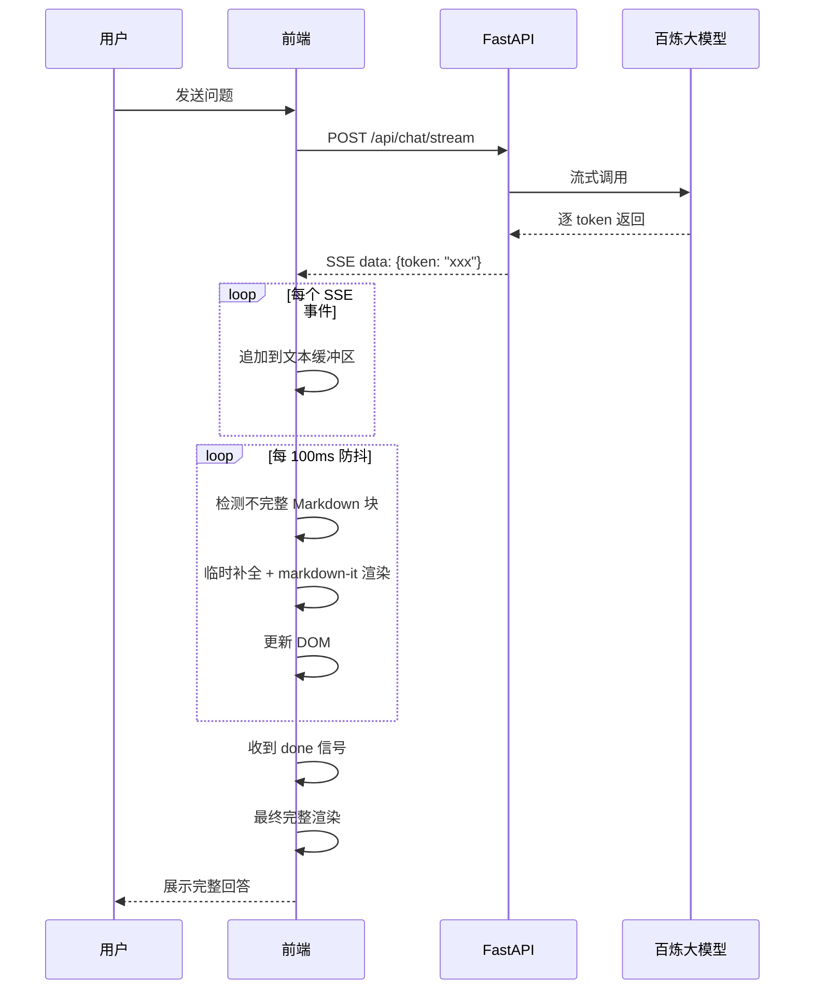

# 05g-流式响应与渲染

# 05g - 流式响应与前端 Markdown 实时渲染

> AI 回答是逐 token 生成的，用户需要看到"打字机效果"的流式输出。但回答里包含代码块、表格、列表等 Markdown 元素，流式渲染时 Markdown 可能不完整——表格只输出了一半，代码块还没闭合。

## 1. 导读

流式响应是提升用户体验的关键——让用户在 AI "思考"时就能看到逐步生成的内容，而不是等 5 秒后一次性显示全部。技术难点在于 SSE 流式传输和前端 Markdown 中间态渲染。

## 2. 为什么难

*   **Markdown 中间态不完整**：流式传输过程中，Markdown 文本是逐步到达的。比如一个表格，前 3 行已经到了但后 2 行还没到，此时直接渲染会显示破损的表格
    
*   **代码块未闭合**：代码块以 ````` 开始，但结束的 ````` 还没到，渲染器可能把后续文本都当作代码
    
*   **SSE 与 Axios 兼容性**：原生 Axios 不直接支持 SSE 流式读取，需要额外处理
    
*   **性能**：每收到一个 token 就触发 Markdown 重新渲染，频繁 DOM 更新可能卡顿
    

## 3. 技术方案

### 3.1 后端 SSE 流式输出

FastAPI 原生支持 `StreamingResponse`，配合百炼 SDK 的流式调用，逐 chunk 推送：

```python
from fastapi.responses import StreamingResponse

@app.post("/api/chat/stream")
async def chat_stream(request: ChatRequest):
    async def event_generator():
        async for token in langchain_stream(request):
            yield f"data: {json.dumps({'token': token})}\n\n"
        yield f"data: {json.dumps({'done': True})}\n\n"
    return StreamingResponse(event_generator(), media_type="text/event-stream")
```

### 3.2 前端缓冲 + 防抖渲染

*   使用 `EventSource` 或 `fetch` + `ReadableStream` 接收 SSE
    
*   维护一个文本缓冲区，每 100ms 防抖一次触发 Markdown 渲染（而非每个 token 都渲染）
    
*   对不完整的 Markdown 块（未闭合的代码块、未完成的表格）做预处理：临时补全闭合标记
    

### 3.3 Markdown 中间态处理

| 场景 | 检测方式 | 临时处理 |
| --- | --- | --- |
| 代码块未闭合 | 检测 ````` 出现次数是否为偶数 | 末尾临时追加 `````，渲染完成后移除 |
| 表格行不完整 | 最后一行 `\|` 数量少于表头 | 临时隐藏最后一行，等完整后再显示 |
| 列表项不完整 | 最后一项无换行符 | 正常渲染，不特殊处理 |

## 4. 实现思路



## 5. 关键代码示例

```typescript
async function streamChat(question: string, onToken: (text: string) => void) {
  const response = await fetch('/api/chat/stream', {
    method: 'POST',
    headers: { 'Content-Type': 'application/json' },
    body: JSON.stringify({ question })
  })
  const reader = response.body!.getReader()
  const decoder = new TextDecoder()
  let buffer = ''

  while (true) {
    const { done, value } = await reader.read()
    if (done) break
    const chunk = decoder.decode(value, { stream: true })
    const lines = chunk.split('\n')
    for (const line of lines) {
      if (line.startsWith('data: ')) {
        const data = JSON.parse(line.slice(6))
        if (data.token) {
          buffer += data.token
          onToken(buffer)
        }
        if (data.done) return buffer
      }
    }
  }
  return buffer
}

function renderPartialMarkdown(text: string): string {
  let processed = text

  const codeBlockCount = (processed.match(/```/g) || [ ]).length

  if (codeBlockCount % 2 !== 0) {
    processed += '\n```'
  }
  return md.render(processed)
}
```

## 6. 涉及业务模块

*   **智能问答引擎**：SSE 流式输出的后端实现
    
*   **前端对话页面**：流式接收和 Markdown 实时渲染