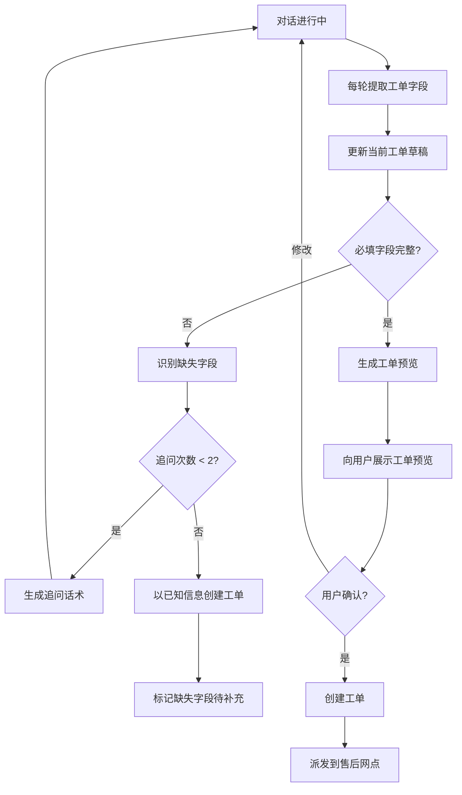

# 05h-工单信息完整性

# 05h - 工单自动创建的信息完整性保障

> 从对话中自动提取工单信息听起来简单，但用户可能说了半天也没提到设备序列号，或者故障描述只有"不好使了"。创建一份残缺的工单比没有工单更糟——售后网点会反复联系客户确认。

## 1. 导读

工单自动创建的核心不是"创建"而是"信息完整"。系统必须知道一份合格的工单需要哪些字段、当前对话已经提供了哪些、还缺哪些，然后主动追问补齐。

## 2. 为什么难

*   **信息分散在多轮对话中**：设备型号可能第一轮就说了，序列号可能第五轮才提供，故障描述可能贯穿整个对话
    
*   **用户表达不规范**：用户说"那个黑色的小摄像头"而不是"DS-2CD2T47"，需要从描述推断或追问
    
*   **必填字段与可选字段**：不同工单类型（故障报修 vs 选型咨询）的必填字段不同
    
*   **信息可能矛盾**：用户前一轮说"3 台设备"后一轮说"5 台"，需要取最新信息
    

## 3. 技术方案

### 3.1 工单字段定义

| 字段 | 类型 | 必填 | 提取方式 |
| --- | --- | --- | --- |
| 设备型号 | string | 是 | 从对话中提取，正则匹配海康型号格式（DS-xxxx） |
| 设备序列号 | string | 是（报修时） | 从对话中提取，或引导用户查看设备标签 |
| 故障现象 | string | 是 | 大模型从对话摘要中提取结构化描述 |
| 联系方式 | string | 是 | 从用户注册信息获取，或对话中补充 |
| 问题分类 | enum | 是 | 意图分类结果直接映射 |
| 故障发生时间 | datetime | 否 | 对话中提取相对时间（"昨天下午"→ 具体日期） |
| 已尝试操作 | list | 否 | 从多轮诊断记录中提取 |
| 附件（截图/日志） | file | 否 | 引导用户上传 |

### 3.2 信息完整度检查与追问策略

每次对话轮次后检查工单字段完成度：

1.  检查必填字段是否齐全
    
2.  缺失字段生成追问话术（自然语言，不是表单）
    
3.  追问优先级：设备序列号 > 故障现象 > 联系方式
    
4.  连续追问不超过 2 轮，超过后允许以"未知"填充非关键字段创建工单
    

### 3.3 信息更新策略

*   **最新优先**：同一字段多次出现时，取最后一次的值
    
*   **冲突确认**：如果新提取的值与之前的明显不同（如设备数量从 3 变 5），向用户确认
    

## 4. 实现思路



## 5. 关键代码示例

```python
REQUIRED_FIELDS = {
    "fault_repair": ["device_model", "serial_number", "fault_description", "contact_info"],
    "general_inquiry": ["device_model", "contact_info"]
}

def extract_ticket_fields(conversation_history: list[dict], ticket_type: str) -> dict:
    prompt = f"""从以下对话中提取工单信息，输出 JSON：
    - device_model: 设备型号（格式如 DS-xxxx）
    - serial_number: 设备序列号
    - fault_description: 故障现象描述（一句话概括）
    - contact_info: 联系方式
    
    对话记录：
    {format_conversation(conversation_history)}
    
    只输出已有信息，缺失字段不编造，输出 null。"""
    
    response = call_llm(prompt)
    return parse_ticket_fields(response)

def check_completeness(fields: dict, ticket_type: str) -> list[str]:
    required = REQUIRED_FIELDS.get(ticket_type, REQUIRED_FIELDS["general_inquiry"])
    missing = [f for f in required if not fields.get(f)]
    return missing

def generate_followup_question(missing_fields: list[str]) -> str:
    questions = {
        "serial_number": "方便提供一下设备的序列号吗？一般在设备底部标签或包装盒上可以看到。",
        "fault_description": "能再具体描述一下故障现象吗？比如是什么情况下出现的、有没有错误提示？",
        "contact_info": "请提供一下您的联系电话，方便售后网点后续联系您。"
    }
    return questions.get(missing_fields[0], "还需要补充一些信息，请描述更多细节。")
```

## 6. 涉及业务模块

*   **工单管理**：工单创建的完整流程
    
*   **智能问答引擎**：对话过程中持续提取工单信息