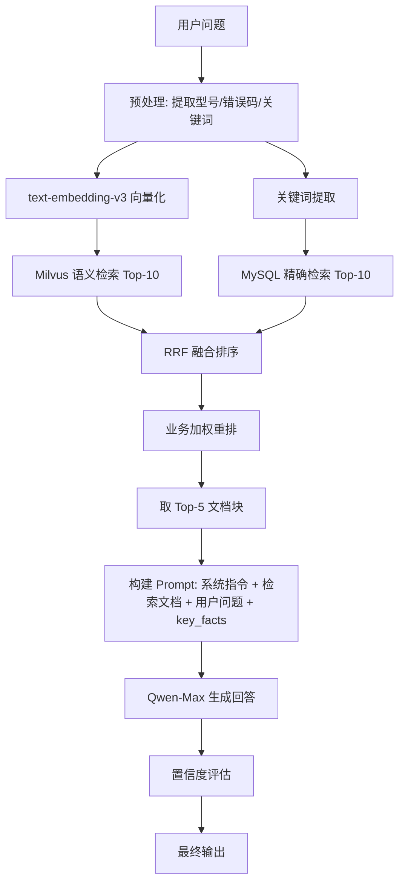
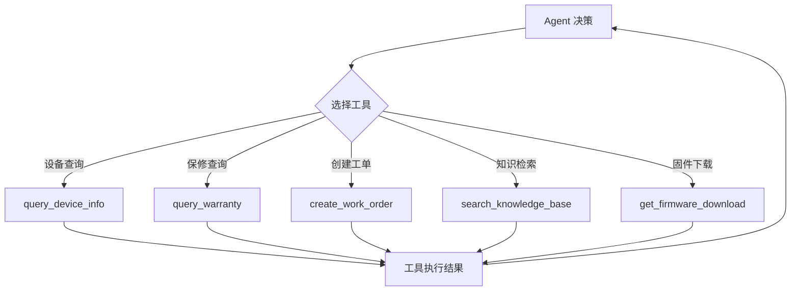

# 06-AI能力链路设计

# 06 - AI 能力链路设计

> 这份文档把项目真正依赖的 AI 能力讲清楚——不是所有模块都走 RAG，也不是所有场景都需要 Agent。每个模块对应什么 AI 能力形态、输入输出是什么、异常怎么处理，都在这里定义。

## 1. AI 能力形态判定

本项目为 **RAG + Agent 混合型**：

| 形态 | 适用模块 | 说明 |
| --- | --- | --- |
| **RAG（检索增强生成）** | 智能问答引擎、设备信息查询辅助 | 用户提问 → 混合检索 → 大模型生成带引用的回答 |
| **Agent（工具调用）** | 工单管理、设备信息查询 | Agent 根据对话上下文调用工具（查保修、创建工单、查设备参数） |
| **工作流编排** | 对话管理、工单创建流程 | LangGraph 状态机驱动多轮对话和工单信息补齐 |
| **分类** | 意图识别 | Qwen-Turbo 对用户输入进行意图分类 |

## 2. AI 链路详细设计

### 2.1 RAG 检索链路

**输入**：用户自然语言问题 + 当前对话 key\_facts **处理**：混合检索 → 融合排序 → Prompt 构建 → 大模型生成 → 置信度评估 **输出**：结构化回答（含引用来源、置信度评分、处置策略）

### 2.2 Agent 工具调用链路

Agent 在对话过程中可以调用以下工具：

| 工具名称 | 触发条件 | 输入参数 | 输出 |
| --- | --- | --- | --- |
| `query_device_info` | 用户提到设备型号或序列号 | model\_number 或 serial\_number | 设备规格、保修状态、固件版本 |
| `query_warranty` | 意图分类为保修查询 | serial\_number | 保修状态（在保/过期/剩余月数） |
| `create_work_order` | AI 无法解决 或 用户要求报修 | 工单字段（从对话中提取） | 工单号、预计处理时间 |
| `search_knowledge_base` | RAG 检索（Agent 主动调用） | query + filters | 检索结果列表 |
| `get_firmware_download` | 用户询问固件下载 | model\_number | 固件下载链接和版本号 |

### 2.3 LangGraph 工作流编排

对话流程由 LangGraph 状态机驱动，包含以下节点：

| 节点 | 职责 |
| --- | --- |
| `intent_classify` | 意图分类（Qwen-Turbo） |
| `rag_answer` | RAG 检索 + 生成回答 |
| `multi_turn_diagnosis` | 多轮故障诊断引导 |
| `tool_execution` | Agent 工具调用 |
| `ticket_creation` | 工单信息提取与创建 |
| `human_escalation` | 转人工处理 |

## 3. 业务模块到 AI 能力的映射

| 核心模块 | AI 能力 | 链路类型 | 说明 |
| --- | --- | --- | --- |
| 智能问答引擎 | RAG + Agent | 混合 | RAG 检索生成回答，Agent 调用工具获取结构化数据 |
| 对话管理 | 工作流编排 | LangGraph | 状态机驱动多轮对话 |
| 知识库管理 | 向量化 | Embedding | 文档上传后向量化入库（text-embedding-v3） |
| 工单管理 | Agent + 分类 | 工具调用 | Agent 提取信息、创建工单；分类确定工单类型 |
| 设备信息查询 | Agent 工具 | 工具调用 | Agent 调用 query\_device\_info 工具 |
| 对话质量监控 | \- | \- | 纯管理功能，不涉及 AI 调用 |
| 运营分析仪表盘 | \- | \- | 纯管理功能，不涉及 AI 调用 |
| 用户认证与权限 | \- | \- | 纯基础设施，不涉及 AI 调用 |

## 4. 异常与边界处理策略

| 异常场景 | 处理策略 |
| --- | --- |
| 检索结果为空 | 不生成回答，直接告知"未找到相关信息"，引导用户换个描述或转人工 |
| 置信度 < 0.5 | 拒绝猜测，告知信息不足，引导转人工 |
| 大模型调用超时 | 重试 1 次，仍失败则告知"系统繁忙，请稍后重试" |
| 用户连续两轮反馈"没用" | 自动降级为转人工，携带对话摘要 |
| Agent 工具调用失败 | 在回答中说明"暂时无法查询该信息"，不中断对话主流程 |
| 问题涉及安全操作 | 无论置信度如何，附加安全警告提示 |

## 5. 可解释性输出

每个 AI 回答都包含可解释性信息：

| 元素 | 说明 |
| --- | --- |
| 引用来源 | 回答基于哪些知识库文档生成，提供文档标题和链接 |
| 置信度等级 | 高/中/低，用户可见（以颜色或标签形式展示） |
| 工具调用记录 | Agent 调用了哪些工具、传入了什么参数、返回了什么结果 |
| 诊断进度 | 多轮诊断时，展示当前排查到哪一步、已排除的原因 |